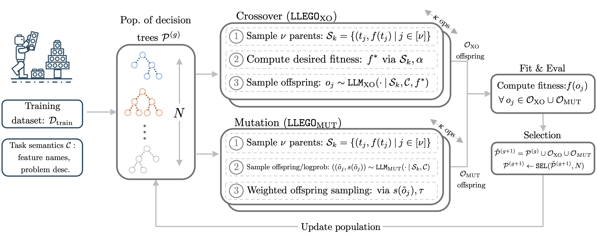

# LLEGO : Decision Tree Induction Through LLMs via Semantically-Aware Evolution 
<p align="center">
    <a href="https://github.com/nicolashuynh/LLEGO/actions/workflows/python-app.yml/badge.svg"></a>
    <a href="https://github.com/nicolashuynh/LLEGO/blob/main/LICENSE"></a>
</p>

Official code repository for our **ICLR'25** paper [Decision Tree Induction Through LLMs via Semantically-Aware Evolution](https://openreview.net/pdf?id=UyhRtB4hjN).

**Authors:** Tennison Liu*, Nicolas Huynh*, Mihaela van der Schaar

**Abstract:** Decision trees are a crucial class of models offering robust predictive performance and inherent interpretability across various domains, including healthcare, finance, and logistics. However, current tree induction methods often face limitations such as suboptimal solutions from greedy methods or prohibitive computational costs and limited applicability of exact optimization approaches. To address these challenges, we propose an evolutionary optimization method for decision tree induction based on genetic programming (GP). Our key innovation is the integration of semantic priors and domain-specific knowledge about the search space into the optimization algorithm. To this end, we introduce **LLEGO**, a framework that incorporates semantic priors into genetic search operators through the use of Large Language Models (LLMs), thereby enhancing search efficiency and targeting regions of the search space that yield decision trees with superior generalization performance. This is operationalized through novel genetic operators that work with structured natural language prompts, effectively utilizing LLMs as conditional generative models and sources of semantic knowledge. Specifically, we introduce *fitness-guided* crossover to exploit high-performing regions, and *diversity-guided* mutation for efficient global exploration of the search space. These operators are controlled by corresponding hyperparameters that enable a more nuanced balance between exploration and exploitation across the search space. Empirically, we demonstrate across various benchmarks that **LLEGO** evolves superior-performing trees compared to existing tree induction methods, and exhibits significantly more efficient search performance compared to conventional GP approaches.


**Overview of LLEGO.** In each generation, LLEGO evolves a population of trees through crossover and mutation operators. These operators are built using LLMs to be semantically aware. Subsequently, offspring are evaluated for fitness and top-N trees are preserved.

 
## 1. Setup
---

1. Create and activate a new environment with conda (with `Python 3.9` or newer).

```shell
conda create -n llego python=3.9
conda activate llego
```
2. Install the necesary requirements (for LLEGO).
```shell
pip install -e .
```

3. Install the external libraries (for the baselines).
 ```shell
bash install_external.sh
```

4. Our code allows for logging via wandb. If you want to use it, make sure it is correctly configured on your machine by following [this guide](https://docs.wandb.ai/quickstart). 


## 2. Reproducing Results
---

1. **Set up LLM credentials.** Our implementation uses the OpenAI family of models via API queries. Add your credentials to configs/endpoint/default.yaml.

2. **Running experiments.** Use `experiments/exp_llego.py` to execute the LLEGO algorithm on a single dataset. For batch processing across all datasets and seeds from the paper, use the provided `run_llego.sh` script. We use Hydra for configuration management. Override default settings with [hydra override syntax](https://hydra.cc/docs/advanced/override_grammar/basic/). The default configuration reflects the settings used in our paper. **Key parameters:**

| Parameter | Description |
|----------------|-------------|
| `dataset` | Target dataset name |
| `seed` | Random seed |
| `max_depth` | Maximum tree depth |
| `exp_name` | Experiment name for logging and saving results | 

The core `Algorithm` class requires these components:

```python
Algorithm(
    # Hyperparameters
    n_iterations: int,       # Number of generations to run
    pop_size: int,           # Size of the population
    n_offspring_mut: int,    # Number of offspring produced by mutation
    n_offspring_xo: int,     # Number of offspring produced by crossover
    use_crossover: bool,     # Whether to use crossover 
    use_mutation: bool,      # Whether to use mutation 
    # Component Classes
    pop_initializer: PopulationInitialization,  # Initializes the population
    pop_selector: SelectionOperator,            # Selects individuals 
    crossover_operator: CrossoverOperator,      # Performs crossover
    mutation_operator: MutationOperator,        # Performs mutation
    fitness_evaluator: FitnessEvaluation,       # Computes the fitness for individuals 
    metrics_logger: MetricsLogger,              # For logging purposes
    hall_of_fame: HallOfFame                    # For logging purposes
)
```
**Note:** To modify any LLEGO component (e.g., population initialization), provide your own implementation of the corresponding class.

3. **Using custom datasets.** To run LLEGO on your own datasets:
* Implement a `get_data()` function (see examples in `utils/data_utils.py`) that returns:
  * `X` (pd.DataFrame): Feature data,
  * `Y` (pd.DataFrame): Target data,
  * `meta_data` (dict): Semantic information about the dataset.
* Create a dataset configuration file at `configs/dataset/{dataset_name}.yaml` that specifies the search objective and task description (see `configs/dataset/abalone.yaml` for reference).


## 3. Citation
---

If our paper or code helped you in your own research, please cite our work as:

```
@inproceedings{
  liu2025decision,
  title={Decision Tree Induction Through {LLM}s via Semantically-Aware Evolution},
  author={Tennison Liu and Nicolas Huynh and Mihaela van der Schaar},
  booktitle={The Thirteenth International Conference on Learning Representations},
  year={2025},
  url={https://openreview.net/forum?id=UyhRtB4hjN}
}
```
